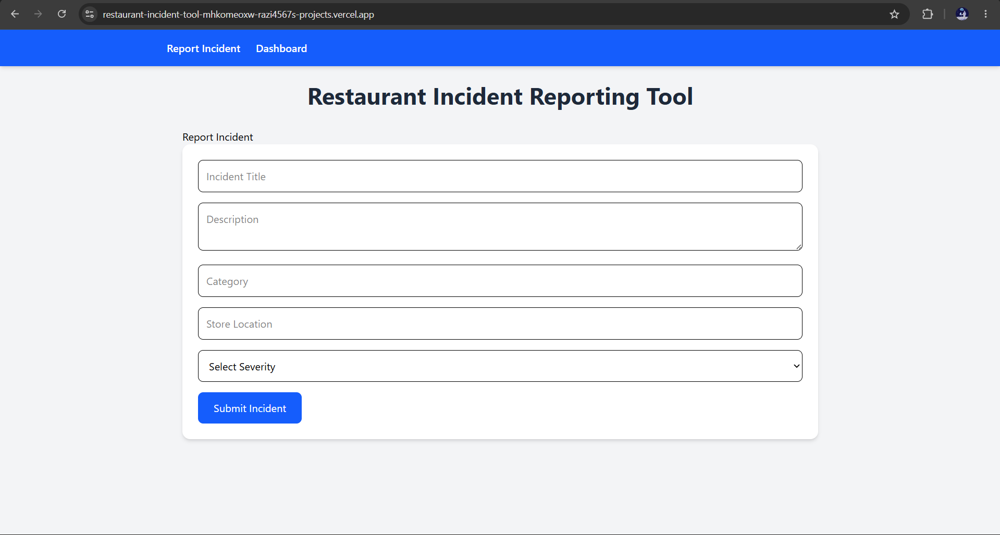
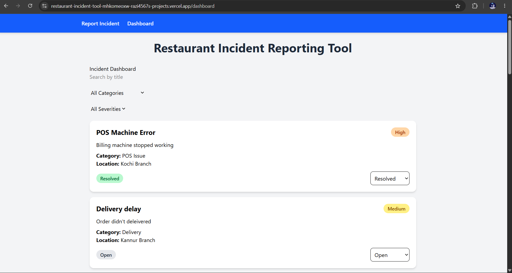

# Restaurant Incident Reporting Tool

A full-stack MERN application for reporting, managing, and tracking restaurant incidents in real time.

## Live Demo

Frontend: https://YOUR-VERCEL-URL.vercel.app

Backend API: https://restaurant-api-hkvh.onrender.com

---

# Features

* Incident reporting form
* Incident dashboard
* Search incidents by title
* Filter by category
* Filter by severity
* Update incident status
* Responsive UI using Tailwind CSS
* MongoDB Atlas integration
* REST API backend
* Real-time UI updates

---

# Tech Stack

## Frontend

* React.js
* React Router DOM
* Axios
* Tailwind CSS
* Vite

## Backend

* Node.js
* Express.js
* MongoDB Atlas
* Mongoose

## Deployment

* Vercel (Frontend)
* Render (Backend)

---

# Project Structure

```bash
restaurant-incident-tool
│
├── client
│   ├── src
│   │   ├── components
│   │   ├── pages
│   │   └── App.jsx
│
├── server
│   ├── models
│   ├── routes
│   └── server.js
```

---

#  Installation & Setup

## Clone Repository

```bash
git clone https://github.com/Razi4567/restaurant-incident-tool.git
```

---

## Frontend Setup

```bash
cd client
npm install
npm run dev
```

---

## Backend Setup

```bash
cd server
npm install
npm start
```

---

#  Environment Variables

Create a `.env` file inside the `server` folder.

```env
MONGO_URI=your_mongodb_connection_string
```

---

# Screenshots

## Incident Reporting Page


## Dashboard Page



---

API Endpoints

Create Incident

```http
POST /api/incidents
```

Get All Incidents

```http
GET /api/incidents
```

Update Incident Status

```http
PUT /api/incidents/:id
```

---

Future Improvements

* Authentication system
* Delete incidents
* Edit incident details
* Analytics dashboard
* Toast notifications
* Dark mode

---

# Author

Razi

GitHub: https://github.com/Razi4567
